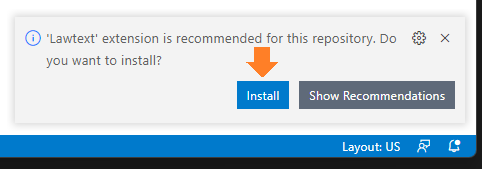
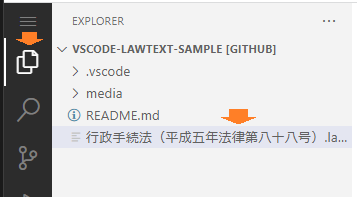
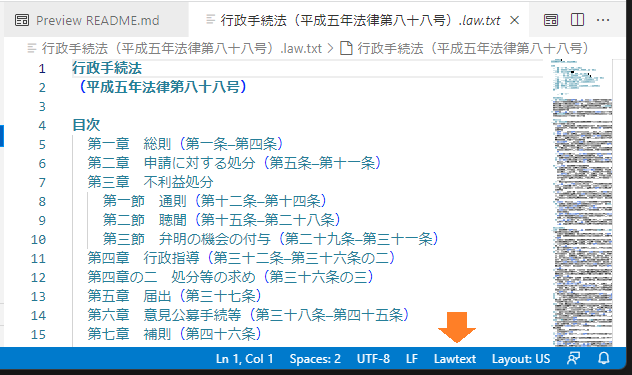

# Lawtext VSCode 拡張機能 / Lawtext VSCode Extension

## 試用方法 / How to try

1. 下記のような案内が右下に表示されたら、インストールボタンをクリックしてください。 / When a prompt like the below appears, click "Install."

    

    もし案内が表示されない場合は、下記リンクからLawtext拡張機能をインストールしてください。 / If the prompt does not appear, install the extension from the link below.

    [Lawtext拡張機能 / Lawtext extension](vscode:extension/yamachi.lawtext)

2. 次に、下記リンクをクリックして「行政手続法」のLawtextファイルを表示してください。 / Then, click the link below to open the Lawtext file of "行政手続法" (the Administrative Procedure Act).

    [行政手続法（平成五年法律第八十八号）.law.txt](./%E8%A1%8C%E6%94%BF%E6%89%8B%E7%B6%9A%E6%B3%95%EF%BC%88%E5%B9%B3%E6%88%90%E4%BA%94%E5%B9%B4%E6%B3%95%E5%BE%8B%E7%AC%AC%E5%85%AB%E5%8D%81%E5%85%AB%E5%8F%B7%EF%BC%89.law.txt)

    もしくは、左側のエクスプローラパネルからも開けます。 / Or, you can open the file from the explorer panel.

    

3. 法令文が色付きで表示され、右下に「Lawtext」と表示されていることをご確認ください。 / Make sure the law text is highlighted with colors and "Lawtext" is displayed at the bottom.

    

----

法令元データの取得に<a href="https://elaws.e-gov.go.jp/apitop/" target="_blank" rel="noreferrer">e-Gov法令API</a>を使用しています。定義語・条項参照などの表示は<a href="https://github.com/yamachig/lawtext" target="_blank" rel="noreferrer">Lawtext</a>で別途解析・編集したものです。

[Lawtext @ GitHub](https://github.com/yamachig/Lawtext)